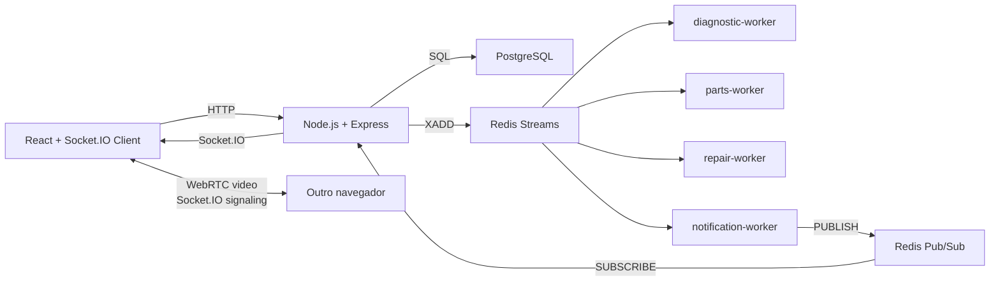

# PitTrack

Sistema Distribuído de Rastreamento de Manutenção Veicular.

O PitTrack é um protótipo acadêmico para a disciplina XRSC09 - Sistemas Distribuídos. Ele simula uma plataforma para oficinas mecânicas pequenas e médias acompanharem ordens de serviço e enviarem atualizações em tempo real aos clientes.

## Objetivo

O foco não é um frontend sofisticado, mas a demonstração clara de uma aplicação distribuída:

- API e workers em processos separados;
- comunicação assíncrona por Redis Streams;
- notificações ao vivo por Redis Pub/Sub;
- persistência em PostgreSQL;
- frontend recebendo eventos por Socket.IO;
- upload real de fotos/vídeos por etapa;
- live WebRTC simples com sinalização por Socket.IO;
- logs didáticos para apresentação em sala.

## Modelo de negócio

Oficinas pequenas e médias dependem de ligações e mensagens manuais para informar o andamento de reparos. Isso reduz transparência, consome tempo da equipe e dificulta manter evidências do serviço executado.

O PitTrack resolve esse problema com um fluxo centralizado de manutenção: ordem de serviço, diagnóstico, orçamento, aprovação, peças, vídeos/fotos por etapa, testes finais e histórico. Em um cenário real, a solução poderia ser oferecida como assinatura mensal para oficinas, com cobrança por quantidade de ordens ativas, usuários internos e armazenamento de mídia.

## Arquitetura resumida



## Tecnologias

- Backend: Node.js, Express, Socket.IO, ioredis, pg
- Upload: multer, pasta local `backend/uploads`
- Frontend: React, Vite, Socket.IO Client
- Live: WebRTC entre navegadores, com Socket.IO para sinalização
- Middleware: Redis Streams e Redis Pub/Sub
- Banco: PostgreSQL
- Infraestrutura: Docker Compose

## Como rodar

Crie o arquivo `.env` a partir do exemplo:

```powershell
Copy-Item .env.example .env
```

Suba todos os serviços:

```powershell
docker compose up --build
```

Se sua instalação do Docker usar o comando legado:

```powershell
docker-compose up --build
```

Acesse:

- Tela da oficina: http://localhost:5173/oficina
- Tela do cliente: http://localhost:5173/cliente/ID_DA_ORDEM
- API: http://localhost:3001
- Health check: http://localhost:3001/health

## Rodando em dois computadores

No computador que vai rodar o Docker, descubra o IP da rede:

```powershell
ipconfig
```

Use o IPv4 da placa Wi-Fi/Ethernet. Exemplo: `192.168.0.25`.

No `.env`, ajuste:

```env
VITE_API_URL=http://192.168.0.25:3001
CORS_ORIGIN=http://localhost:5173,http://192.168.0.25:5173
```

Suba novamente:

```powershell
docker compose up --build
```

No outro computador, abra:

```text
http://192.168.0.25:5173/oficina
http://192.168.0.25:5173/cliente/ID_DA_ORDEM
```

Os dois computadores precisam estar na mesma rede e o firewall do Windows precisa permitir acesso às portas `5173` e `3001`.

Observação importante: câmera/microfone via WebRTC normalmente exigem HTTPS, exceto em `localhost`. Para testar a live em dois computadores por HTTP, use uma destas opções:

- testar a live em duas abas no mesmo computador usando `localhost`;
- habilitar no Chrome a flag `chrome://flags/#unsafely-treat-insecure-origin-as-secure` para `http://192.168.0.25:5173`;
- usar HTTPS/túnel local em uma versão posterior.

## Como testar

Pelo frontend:

1. Abra a tela da oficina em `/oficina`.
2. Clique em `Criar ordem exemplo`.
3. Abra a tela do cliente pelo botão `Visão do cliente` ou pela URL `/cliente/ID_DA_ORDEM`.
4. Na oficina, avance manualmente: `Iniciar diagnóstico`, `Finalizar diagnóstico`, `Gerar orçamento`.
5. No cliente, aprove o orçamento.
6. Na oficina, clique em `Iniciar reparo`, `Solicitar peça`, `Substituir peça`.
7. Envie uma foto ou vídeo real em `Mídia real`.
8. Para live, na oficina clique em `Iniciar live`; no cliente clique em `Entrar na live`.
9. Acompanhe o painel de eventos em tempo real nas duas telas.

Pela API:

```powershell
curl http://localhost:3001/health
curl http://localhost:3001/orders
```

## Papel dos componentes distribuídos

### PostgreSQL

Guarda o estado permanente: clientes, veículos, ordens, status, orçamentos, peças, substituições e mídias.

### Redis Streams

Funciona como log de eventos importantes. A API publica eventos como `SERVICE_ORDER_CREATED`, `BUDGET_APPROVED`, `MEDIA_UPLOADED`, `LIVE_STARTED` e `LIVE_ENDED`. Workers independentes consomem esses eventos com `XREADGROUP`.

Na versão atual, as etapas principais são manuais. Os workers não avançam diagnóstico ou reparo sozinhos; eles demonstram processos independentes reagindo aos eventos, gerando logs e, no caso de peças, simulando reserva/rastreio.

### Redis Pub/Sub

É usado para notificação ao vivo. O `notification-worker` lê eventos do stream e publica no canal `live-notifications`. A API assina esse canal e repassa os eventos ao frontend via Socket.IO.

## Logs úteis

Ver API e workers:

```powershell
docker compose logs -f backend diagnostic-worker parts-worker repair-worker notification-worker
```

Ver o stream Redis:

```powershell
docker compose exec redis redis-cli XRANGE pittrack:events - +
```

Assinar o canal Pub/Sub:

```powershell
docker compose exec redis redis-cli SUBSCRIBE live-notifications
```

## Demonstração em sala

Mostre três telas ao mesmo tempo:

- tela da oficina em http://localhost:5173/oficina;
- tela do cliente em http://localhost:5173/cliente/ID_DA_ORDEM;
- terminal com logs dos workers;
- terminal com inspeção do Redis Streams ou Pub/Sub.

Roteiro sugerido:

1. Criar uma ordem de serviço.
2. Mostrar `SERVICE_ORDER_CREATED` no stream.
3. Mostrar `diagnostic-worker` reagindo ao evento.
4. Abrir a visão do cliente da ordem.
5. Gerar orçamento na oficina e aprovar no cliente.
6. Mostrar `repair-worker` consumindo `BUDGET_APPROVED` sem avançar tudo automaticamente.
7. Solicitar peça e mostrar `parts-worker` gerando rastreio.
8. Enviar uma foto/vídeo real e mostrar `MEDIA_UPLOADED`.
9. Iniciar uma live entre as telas de oficina e cliente.
10. Mostrar `notification-worker` publicando no Pub/Sub.
11. Mostrar o frontend recebendo `order-event` via Socket.IO.

## Documentação complementar

- [Arquitetura](docs/architecture.md)
- [Eventos](docs/events.md)
- [Setup](docs/setup.md)
