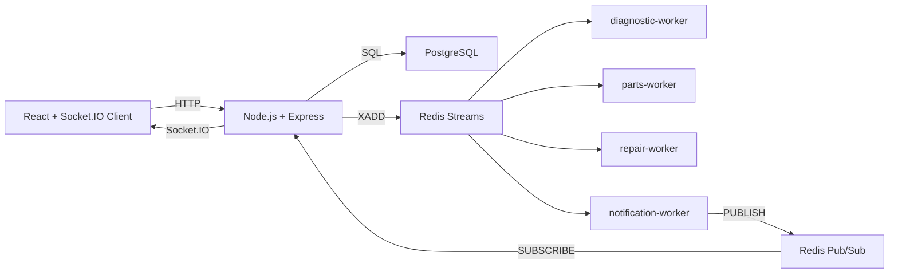

# PitTrack

Sistema Distribuído de Rastreamento de Manutenção Veicular.

O PitTrack é um protótipo acadêmico para a disciplina XRSC09 - Sistemas Distribuídos. Ele simula uma plataforma para oficinas mecânicas pequenas e médias acompanharem ordens de serviço e enviarem atualizações em tempo real aos clientes.

## Objetivo

O foco não é um frontend sofisticado, mas a demonstração clara de uma aplicação distribuída:

- API e workers em processos separados;
- comunicação assíncrona por Redis Streams;
- notificações ao vivo por Redis Pub/Sub;
- persistência em PostgreSQL;
- frontend recebendo eventos por Socket.IO;
- logs didáticos para apresentação em sala.

## Modelo de negócio

Oficinas pequenas e médias dependem de ligações e mensagens manuais para informar o andamento de reparos. Isso reduz transparência, consome tempo da equipe e dificulta manter evidências do serviço executado.

O PitTrack resolve esse problema com um fluxo centralizado de manutenção: ordem de serviço, diagnóstico, orçamento, aprovação, peças, vídeos/fotos por etapa, testes finais e histórico. Em um cenário real, a solução poderia ser oferecida como assinatura mensal para oficinas, com cobrança por quantidade de ordens ativas, usuários internos e armazenamento de mídia.

## Arquitetura resumida



## Tecnologias

- Backend: Node.js, Express, Socket.IO, ioredis, pg
- Frontend: React, Vite, Socket.IO Client
- Middleware: Redis Streams e Redis Pub/Sub
- Banco: PostgreSQL
- Infraestrutura: Docker Compose

## Como rodar

Crie o arquivo `.env` a partir do exemplo:

```powershell
Copy-Item .env.example .env
```

Suba todos os serviços:

```powershell
docker compose up --build
```

Se sua instalação do Docker usar o comando legado:

```powershell
docker-compose up --build
```

Acesse:

- Frontend: http://localhost:5173
- API: http://localhost:3001
- Health check: http://localhost:3001/health

## Como testar

Pelo frontend:

1. Clique em `Criar ordem exemplo`.
2. Veja o diagnóstico automático iniciar pelo worker.
3. Clique em `Gerar orçamento`.
4. Clique em `Aprovar`.
5. Veja o worker de reparo avançar a ordem.
6. Clique em `Registrar peça`.
7. Veja o worker de peças simular rastreio e substituição.
8. Clique em `Registrar vídeo`.
9. Acompanhe o painel de eventos em tempo real.

Pela API:

```powershell
curl http://localhost:3001/health
curl http://localhost:3001/orders
```

## Papel dos componentes distribuídos

### PostgreSQL

Guarda o estado permanente: clientes, veículos, ordens, status, orçamentos, peças, substituições e mídias.

### Redis Streams

Funciona como log de eventos importantes. A API publica eventos como `SERVICE_ORDER_CREATED`, `BUDGET_APPROVED` e `VIDEO_UPLOADED`. Workers independentes consomem esses eventos com `XREADGROUP`.

### Redis Pub/Sub

É usado para notificação ao vivo. O `notification-worker` lê eventos do stream e publica no canal `live-notifications`. A API assina esse canal e repassa os eventos ao frontend via Socket.IO.

## Logs úteis

Ver API e workers:

```powershell
docker compose logs -f ordem-servico-api diagnostic-worker parts-worker repair-worker notification-worker
```

Ver o stream Redis:

```powershell
docker compose exec redis redis-cli XRANGE pittrack:events - +
```

Assinar o canal Pub/Sub:

```powershell
docker compose exec redis redis-cli SUBSCRIBE live-notifications
```

## Demonstração em sala

Mostre três telas ao mesmo tempo:

- frontend em http://localhost:5173;
- terminal com logs dos workers;
- terminal com inspeção do Redis Streams ou Pub/Sub.

Roteiro sugerido:

1. Criar uma ordem de serviço.
2. Mostrar `SERVICE_ORDER_CREATED` no stream.
3. Mostrar `diagnostic-worker` reagindo ao evento.
4. Gerar e aprovar um orçamento.
5. Mostrar `repair-worker` consumindo `BUDGET_APPROVED`.
6. Registrar peça e vídeo.
7. Mostrar `notification-worker` publicando no Pub/Sub.
8. Mostrar o frontend recebendo `order-event` via Socket.IO.

## Documentação complementar

- [Arquitetura](docs/architecture.md)
- [Eventos](docs/events.md)
- [Setup](docs/setup.md)
