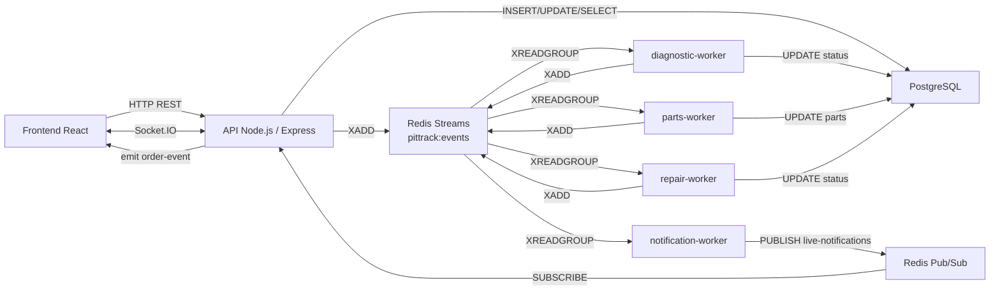
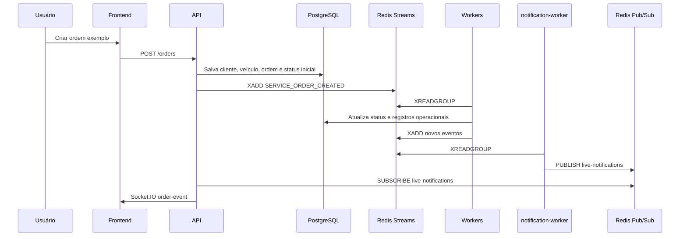

# Arquitetura do PitTrack

## Problema de negócio

Oficinas pequenas e médias costumam acompanhar manutenções por ligações, mensagens informais e anotações locais. Isso cria três problemas recorrentes:

- o cliente não sabe em que etapa o veículo está;
- a oficina perde rastreabilidade sobre orçamento, peças, evidências e responsáveis;
- o atendimento depende de interrupções manuais para informar cada atualização.

O PitTrack propõe uma plataforma leve para registrar ordens de serviço e publicar atualizações em tempo real. O valor de negócio está na transparência operacional: o cliente acompanha diagnóstico, orçamento, peças, reparo, testes finais e registros visuais sem precisar acionar a oficina a todo momento.

## Escopo do protótipo

O protótipo prioriza os conceitos de Sistemas Distribuídos:

- processos independentes para API e workers;
- Redis Streams como log de eventos importantes;
- Redis Pub/Sub para notificações ao vivo;
- PostgreSQL para persistência relacional;
- Socket.IO para entregar atualizações ao navegador;
- logs explícitos para demonstrar troca de mensagens.

Autenticação, gestão financeira completa e upload físico de arquivos não fazem parte desta primeira versão.

## Visão geral

## Componentes

### Frontend

Aplicação React com Vite. Ela consulta a API por HTTP e mantém uma conexão Socket.IO para receber eventos em tempo real.

### Backend/API

Aplicação Node.js com Express. Responsável por:

- receber comandos HTTP;
- persistir dados permanentes no PostgreSQL;
- publicar eventos de negócio no Redis Streams;
- assinar o canal Pub/Sub `live-notifications`;
- repassar notificações aos clientes conectados por Socket.IO.

### PostgreSQL

Banco relacional usado para estado permanente:

- clientes;
- veículos;
- ordens de serviço;
- histórico de status;
- orçamentos;
- peças;
- substituições;
- mídias registradas.

### Redis Streams

Middleware de eventos persistente. A API e os workers publicam eventos usando `XADD`; os workers consomem com grupos independentes via `XREADGROUP`.

Cada worker possui seu próprio consumer group para que todos possam observar o mesmo stream sem competir entre si.

### Redis Pub/Sub

Canal de entrega ao vivo. O `notification-worker` transforma eventos do stream em mensagens publicadas no canal `live-notifications`. A API assina esse canal e envia as mensagens ao frontend.

### Workers

- `diagnostic-worker`: reage a `SERVICE_ORDER_CREATED`, inicia o diagnóstico e publica `DIAGNOSIS_STARTED` e `DIAGNOSIS_FINISHED`.
- `parts-worker`: reage a `PART_RESERVED`, simula rastreio/reserva de peça e publica `PART_REPLACED`.
- `repair-worker`: reage a `BUDGET_APPROVED`, simula reparo, testes finais e finalização.
- `notification-worker`: escuta todos os eventos e publica notificações via Redis Pub/Sub.

## Fluxo principal

## Modelo de negócio

O sistema atende oficinas que precisam melhorar a comunicação sem adotar um ERP complexo. O produto poderia ser oferecido como assinatura mensal simples para oficinas, com limites por número de ordens ativas, armazenamento de mídia e usuários internos.

Benefícios para a oficina:

- menos ligações repetitivas sobre andamento;
- histórico centralizado da manutenção;
- evidências visuais do serviço executado;
- rastreio de peças e orçamento em um único fluxo;
- melhoria de confiança com o cliente.

Benefícios para o cliente:

- acompanhamento em tempo real;
- evidências por etapa;
- aprovação de orçamento com contexto;
- histórico consultável do serviço.

## Limitações assumidas

- vídeos são registrados por URL/metadados, não enviados fisicamente;
- não há autenticação nesta versão;
- os tempos dos workers são simulados;
- não há garantia transacional entre PostgreSQL e Redis Streams;
- o frontend é apenas suficiente para demonstrar o fluxo distribuído.
